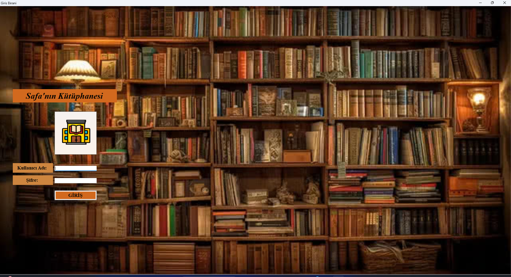
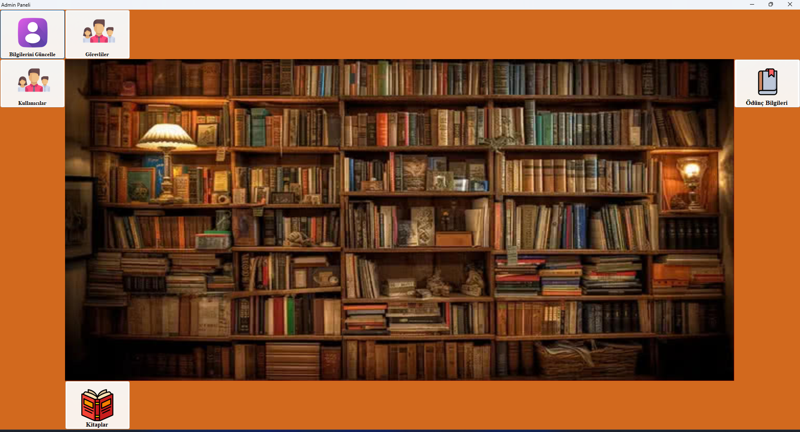
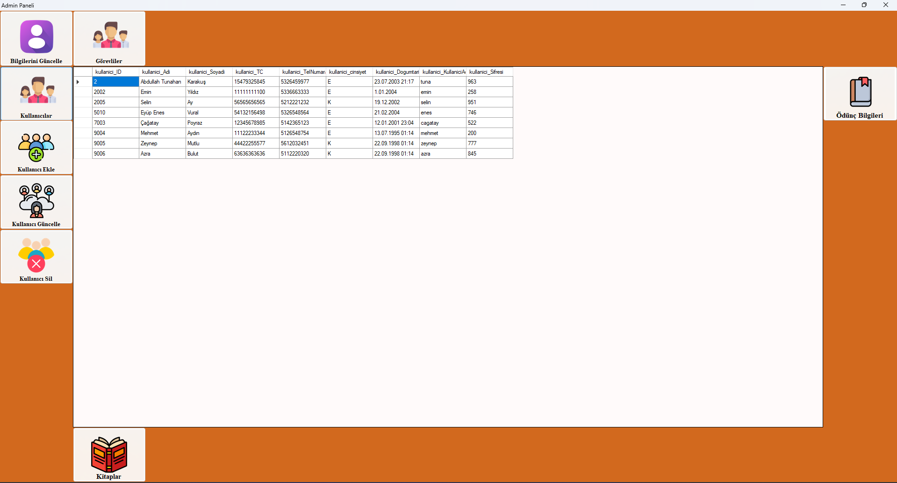
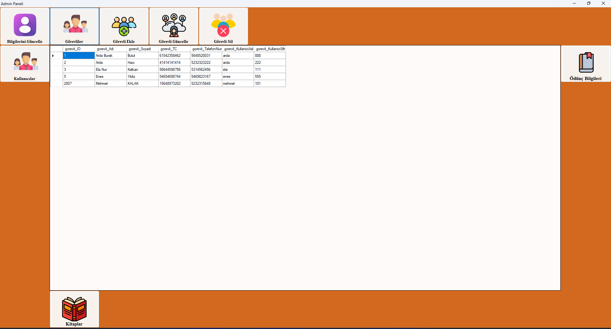
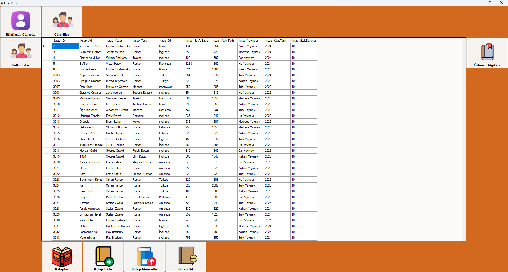
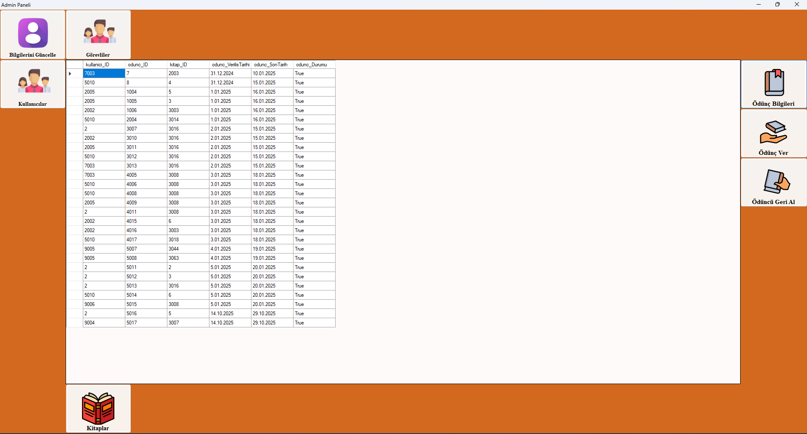

# 📚 Kütüphane Otomasyonu

SQL Server ve C# kullanılarak geliştirilmiş bu proje, masaüstü ortamda çalışan kapsamlı bir **kütüphane yönetim sistemidir**. Sistem; kitap, kullanıcı ve ödünç işlemlerini merkezi bir yapı üzerinden yönetmeyi amaçlar.

Bu çalışma, **.NET 8**, **Entity Framework** ve **SQL Server** teknolojileri kullanılarak geliştirilmiş olup, rol bazlı erişim kontrolü içeren gerçekçi bir otomasyon örneğidir.

---

## 🎯 Amaç

Bu projenin amacı:

* Kütüphane yönetim süreçlerini dijital ortama taşımak
* Kullanıcı, görevli ve admin rollerini ayrıştırarak yetki bazlı bir yapı kurmak
* CRUD işlemlerini (Create, Read, Update, Delete) etkin şekilde uygulamak
* Veritabanı ile entegre çalışan bir masaüstü uygulama geliştirmek

---

## 🚀 Özellikler

* 📘 **Kitap Yönetimi**

  * Kitap ekleme, güncelleme ve silme
  * Kitap bilgilerini detaylı görüntüleme

* 👤 **Kullanıcı Yönetimi**

  * Kullanıcı ekleme, güncelleme ve silme
  * Kullanıcı bilgilerini listeleme

* 🧑‍💼 **Görevli Yönetimi**

  * Görevli ekleme, güncelleme ve silme
  * Yetkili kullanıcı kontrolü

* 🔄 **Ödünç İşlemleri**

  * Kitap ödünç verme
  * Kitap iade alma
  * Ödünç geçmişini görüntüleme

* 🔐 **Rol Bazlı Giriş Sistemi**

  * Admin
  * Görevli
  * Kullanıcı

* ⚙️ **Yapılandırılabilir Veritabanı**

  * JSON tabanlı bağlantı ayarları

---

## 🖼️ Uygulama Ekran Görüntüleri

### 🔐 Giriş Ekranı



### 🧑‍💼 Admin Paneli



### 👤 Kullanıcı İşlemleri



### 🧑‍💼 Görevli İşlemleri



### 📘 Kitap İşlemleri



### 🔄 Ödünç İşlemleri



---

## 🛠️ Kullanılan Teknolojiler

* **Programlama Dili:** C# (.NET 8)
* **Veritabanı:** Microsoft SQL Server
* **ORM:** Entity Framework
* **Arayüz:** Windows Forms
* **Veri İşleme:** LINQ

---

## 🧩 Kurulum

1. Bu repoyu bilgisayarınıza klonlayın:

   ```bash
   git clone https://github.com/kullaniciadi/Kutuphane_Otomasyonu.git
   ```

2. `dbconfig.example.json` dosyasını kopyalayın ve adını:

   ```
   dbconfig.json
   ```

   olarak değiştirin.

3. İçeriğini kendi SQL Server ayarlarınıza göre düzenleyin:

   ```json
   {
     "Server": "YOUR_SERVER_NAME",
     "Database": "Kutuphane_Otomasyonu",
     "IntegratedSecurity": true,
     "Encrypt": true,
     "TrustServerCertificate": true
   }
   ```

4. SQL Server üzerinde veritabanını oluşturun:

   * `database` klasöründeki `.sql` scriptlerini çalıştırın
   * veya `.bak` dosyasını restore edin

5. Visual Studio ile `.sln` dosyasını açın ve projeyi çalıştırın.

---

## ⚠️ Notlar

* Proje yeniden yapılandırılırken bazı dosyalar klasör yapısına taşınmıştır.
* Namespace yapıları geliştirme ortamına göre güncellenmesi gerekebilir.
* `.csproj.user` dosyası kullanıcıya özeldir ve farklı ortamlarda değişiklik gösterebilir.

---

## 📌 Proje Yapısı

```
📁 src/
 └── Kutuphane_Otomasyonu/
      ├── Data/
      │    └── Models/
      ├── Entities/
      ├── Forms/
      ├── Helpers/

📁 database/
📁 config/
📁 docs/screenshots/
```

---

## 👨‍💻 Geliştirici

**Emir Safa Kaymakçı**

Bu proje, yazılım geliştirme sürecinde veri tabanı entegrasyonu, katmanlı yapı ve kullanıcı arayüzü geliştirme becerilerini göstermek amacıyla hazırlanmıştır.

---

## 📄 Lisans

Bu proje **MIT Lisansı** ile lisanslanmıştır.
